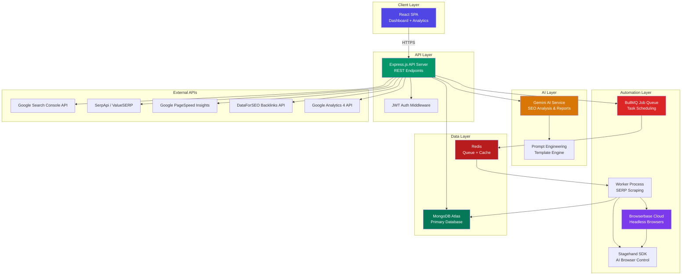
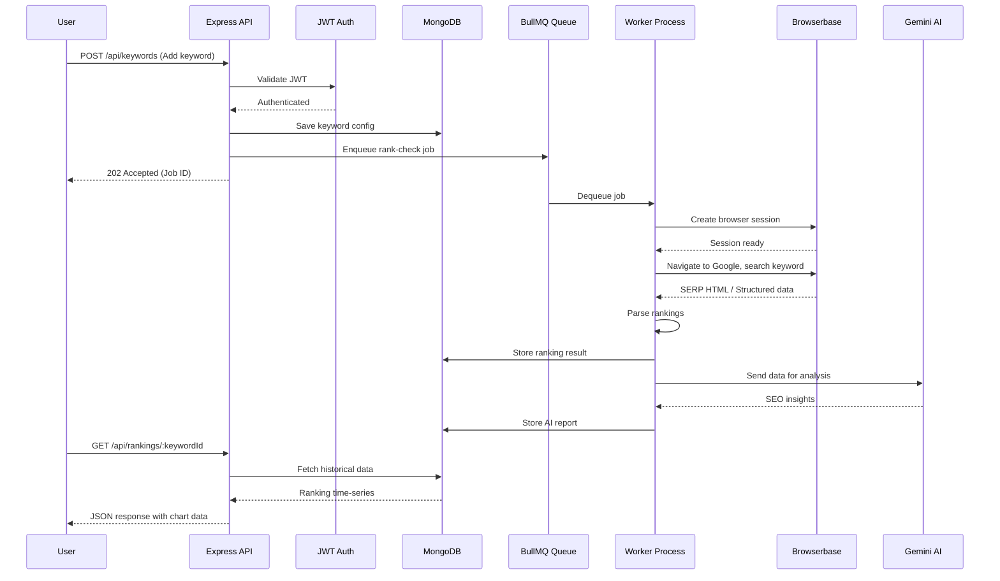
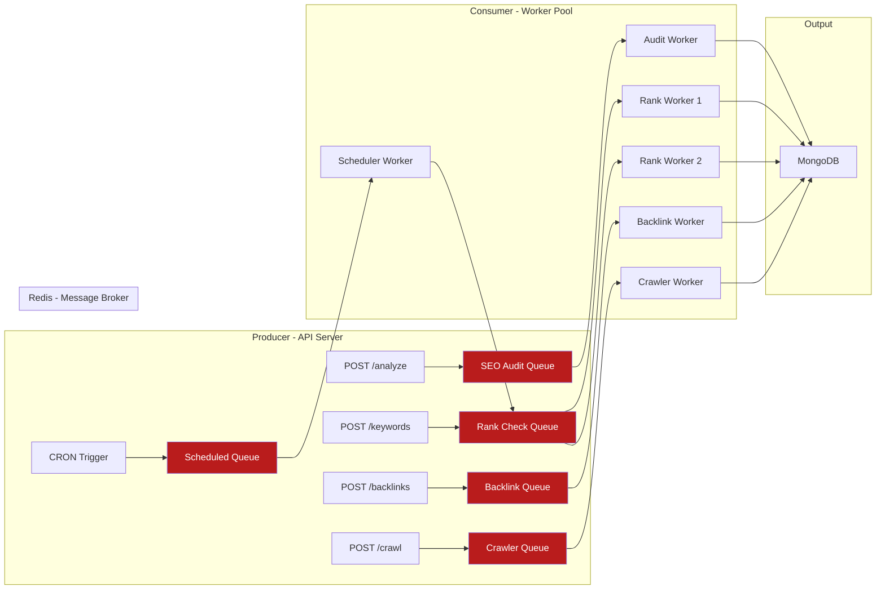

# Full Stack AI SEO Rank Tracker — Project Report

## Part 1: Project Overview, Complete Feature List & Tech Stack

> **Report Version:** 2.0  
> **Date:** May 2026  
> **Project Type:** Full-Stack SaaS Application  
> **Stack:** MERN (MongoDB, Express.js, React, Node.js) + Gemini AI + Browserbase

---

## Table of Contents

1. [Executive Summary](#1-executive-summary)
2. [System Architecture](#2-system-architecture)
3. [Complete Feature List](#3-complete-feature-list)
4. [Comprehensive Tech Stack](#4-comprehensive-tech-stack)
5. [Architecture Decision Records](#5-architecture-decision-records)

---

## 1. Executive Summary

The **Full Stack AI SEO Rank Tracker** is a production-grade SaaS platform that combines traditional SEO auditing with AI-powered analysis, automated keyword rank monitoring, backlink intelligence, and Generative Engine Optimization (GEO). Inspired by industry leaders like **Ahrefs, Semrush, SE Ranking, and Surfer SEO**, this platform delivers:

- **Analyze** any website's SEO health across technical, on-page, and off-page dimensions
- **Generate** AI-powered SEO reports with actionable recommendations using Gemini AI
- **Monitor** keyword rankings across search engines with automated daily tracking
- **Track AI Visibility** — monitor brand presence in AI Overviews, ChatGPT, and Perplexity
- **Backlink Intelligence** — monitor, analyze, and audit your link profile
- **Site Crawler** — deep technical SEO auditing with JS rendering support
- **Competitor Gap Analysis** — find keyword and content gaps vs. competitors
- **Content Optimization** — AI-generated content briefs and topic clusters
- **Automate** browser-based SERP scraping using Browserbase cloud infrastructure
- **Visualize** historical trends through an interactive analytics dashboard
- **White-Label Reporting** — branded PDF/dashboard exports for agencies

The system is architected as a **distributed, event-driven application** where the web-facing API layer is decoupled from the browser automation workers.

---

## 2. System Architecture

### 2.1 High-Level Architecture Diagram

### 2.2 Request Flow Architecture

### 2.3 Distributed Worker Architecture

---

## 3. Complete Feature List

Features are organized into **8 development phases** (42 total features). Features marked with 🆕 are additions inspired by competitor analysis of Ahrefs, Semrush, SE Ranking, Surfer SEO, and Clearscope.

### Phase 1: Foundation & Authentication (Weeks 1–3)

| # | Feature | Priority | Source |
|---|---------|----------|--------|
| 1.1 | MERN Stack Authentication System (JWT + OAuth) | 🔴 Critical | Original |
| 1.2 | MongoDB Database Schema Design | 🔴 Critical | Original |
| 1.3 | REST API Core Architecture | 🔴 Critical | Original |
| 1.4 | React Dashboard Shell & Navigation | 🔴 Critical | Original |
| 1.5 | User Profile, Settings & Subscription Tiers | 🟡 Important | Original |
| 1.6 | 🆕 Multi-Project/Workspace Management | 🟡 Important | Semrush, SE Ranking |

### Phase 2: SEO Analysis Engine (Weeks 4–7)

| # | Feature | Priority | Source |
|---|---------|----------|--------|
| 2.1 | Website SEO Analyzer Tool (On-Page Audit) | 🔴 Critical | Original |
| 2.2 | Technical SEO Audit Module | 🔴 Critical | Original |
| 2.3 | Google PageSpeed & Core Web Vitals Integration | 🟡 Important | Original |
| 2.4 | SEO Score Calculation Engine | 🟡 Important | Original |
| 2.5 | 🆕 Site Crawler (Multi-Page Deep Crawl) | 🔴 Critical | Screaming Frog, Ahrefs |
| 2.6 | 🆕 Structured Data / Schema Markup Validator | 🟡 Important | Ahrefs, Semrush |
| 2.7 | 🆕 Internal Link Structure Analysis | 🟡 Important | Screaming Frog, Sitebulb |

### Phase 3: AI Intelligence Layer (Weeks 8–10)

| # | Feature | Priority | Source |
|---|---------|----------|--------|
| 3.1 | Gemini AI Integration Service | 🔴 Critical | Original |
| 3.2 | AI SEO Report Generator | 🔴 Critical | Original |
| 3.3 | Prompt Engineering Template System | 🟡 Important | Original |
| 3.4 | 🆕 AI Content Brief Generator | 🟡 Important | Surfer SEO, Frase, Clearscope |
| 3.5 | 🆕 AI Content Optimization Scorer | 🟡 Important | Surfer SEO, Clearscope |
| 3.6 | 🆕 AI-Powered Competitor Analysis | 🟡 Important | Semrush, Ahrefs |

### Phase 4: Rank Tracking & Browser Automation (Weeks 11–14)

| # | Feature | Priority | Source |
|---|---------|----------|--------|
| 4.1 | Keyword Rank Monitoring System | 🔴 Critical | Original |
| 4.2 | Browser Automation with Browserbase | 🔴 Critical | Original |
| 4.3 | Stagehand AI-Driven SERP Scraping | 🟡 Important | Original |
| 4.4 | BullMQ Job Queue & Scheduling | 🔴 Critical | Original |
| 4.5 | Google Search Console API Integration | 🟡 Important | Original |
| 4.6 | SERP API Fallback Integration (SerpApi/ValueSERP) | 🟡 Important | Original |
| 4.7 | 🆕 SERP Feature Tracking (Snippets, Map Pack, AI Overview) | 🔴 Critical | Ahrefs, Semrush |
| 4.8 | 🆕 Local SEO Rank Tracking (Geo-Grid) | 🟡 Important | BrightLocal, SE Ranking |
| 4.9 | 🆕 AI Visibility / GEO Tracking | 🟡 Important | AthenaHQ, Peec.AI |

### Phase 5: Backlink Intelligence (Weeks 15–17) 🆕

| # | Feature | Priority | Source |
|---|---------|----------|--------|
| 5.1 | 🆕 Backlink Profile Monitor | 🔴 Critical | Ahrefs, Semrush |
| 5.2 | 🆕 Toxic Link Detection & Disavow Generator | 🟡 Important | Semrush, Moz |
| 5.3 | 🆕 Competitor Backlink Gap Analysis | 🟡 Important | Ahrefs |
| 5.4 | 🆕 New/Lost Backlink Alerts | 🟡 Important | Ahrefs, SE Ranking |

### Phase 6: Keyword Research & Content Strategy (Weeks 18–20) 🆕

| # | Feature | Priority | Source |
|---|---------|----------|--------|
| 6.1 | 🆕 Keyword Research & Discovery Tool | 🔴 Critical | Semrush, Ahrefs |
| 6.2 | 🆕 Keyword Gap Analysis (vs. Competitors) | 🟡 Important | Semrush, Ahrefs |
| 6.3 | 🆕 Topic Cluster & Content Pillar Planner | 🟡 Important | Surfer SEO, MarketMuse |
| 6.4 | 🆕 Share of Voice / Visibility Score Dashboard | 🟡 Important | SE Ranking, Semrush |

### Phase 7: Analytics, Reporting & Integrations (Weeks 21–23)

| # | Feature | Priority | Source |
|---|---------|----------|--------|
| 7.1 | Ranking History Charts & Trends | 🔴 Critical | Original |
| 7.2 | SEO Dashboard with KPI Widgets | 🔴 Critical | Original |
| 7.3 | PDF/CSV Report Export | 🟡 Important | Original |
| 7.4 | Email Notification & Alert System | 🟡 Important | Original |
| 7.5 | 🆕 White-Label Reporting (Agency Mode) | 🟡 Important | SE Ranking, BrightLocal |
| 7.6 | 🆕 Google Analytics 4 Integration | 🟡 Important | Semrush |
| 7.7 | 🆕 Scheduled Automated Reports | 🟡 Important | SE Ranking, AgencyAnalytics |

### Phase 8: Deployment & Production (Weeks 24–26)

| # | Feature | Priority | Source |
|---|---------|----------|--------|
| 8.1 | Docker Containerization | 🔴 Critical | Original |
| 8.2 | CI/CD Pipeline (GitHub Actions) | 🔴 Critical | Original |
| 8.3 | Production Monitoring & Logging | 🟡 Important | Original |
| 8.4 | Security Hardening & Rate Limiting | 🔴 Critical | Original |
| 8.5 | Performance Optimization & Redis Caching | 🟡 Important | Original |

---

## 4. Comprehensive Tech Stack

### 4.1 Frontend

| Category | Technology | Purpose |
|----------|-----------|---------|
| **Framework** | React 19 | Core UI framework |
| **Build Tool** | Vite 6 | Fast HMR, optimized production builds |
| **Routing** | React Router v7 | Client-side routing with data loaders |
| **State Management** | Zustand | Lightweight, scalable global state |
| **Server State** | TanStack Query v5 | API data fetching, caching, synchronization |
| **UI Components** | Shadcn/UI + Radix UI | Accessible, customizable component primitives |
| **Styling** | Tailwind CSS v4 | Utility-first CSS framework |
| **Charts** | Recharts | React-native, SVG-based charting |
| **Tables** | TanStack Table v8 | Headless, performant data tables |
| **Forms** | React Hook Form + Zod | Performant forms with schema validation |
| **Icons** | Lucide React | Consistent, lightweight icon system |
| **Notifications** | Sonner | Toast notification system |
| **PDF Export** | html2canvas + jsPDF | Client-side report export |
| **Markdown** | react-markdown + rehype | Render AI-generated markdown |
| **Geo Heatmaps** | react-leaflet / Mapbox GL | Local SEO rank geo-grid visualization 🆕 |
| **Date Handling** | date-fns | Lightweight date utilities |
| **HTTP Client** | Axios | HTTP requests with interceptor support |

### 4.2 Backend

| Category | Technology | Purpose |
|----------|-----------|---------|
| **Runtime** | Node.js 22 LTS | JavaScript server runtime |
| **Framework** | Express.js 5 | HTTP server and routing |
| **Authentication** | JWT (jsonwebtoken) | Access token generation/validation |
| **Password Hashing** | bcryptjs | Secure password encryption |
| **Validation** | Zod | Runtime schema validation |
| **Rate Limiting** | express-rate-limit | API abuse prevention |
| **CORS** | cors | Cross-origin resource sharing |
| **Security** | helmet + express-mongo-sanitize + hpp | HTTP security headers, NoSQL injection prevention |
| **Logging** | Winston + Morgan | Structured application and HTTP logging |
| **Process Manager** | PM2 | Production process management, clustering |
| **Email** | Nodemailer + Resend | Transactional email delivery |
| **Cron Scheduling** | node-cron | Lightweight recurring task triggers |
| **API Docs** | Swagger (swagger-jsdoc + swagger-ui-express) | Interactive API documentation |
| **CSV Parsing** | csv-parser + json2csv | Keyword import/export 🆕 |
| **PDF Generation** | Puppeteer (server-side PDF) | White-label PDF report generation 🆕 |

### 4.3 Database

| Category | Technology | Purpose |
|----------|-----------|---------|
| **Primary Database** | MongoDB Atlas | Cloud-managed NoSQL document store |
| **ODM** | Mongoose 8 | Schema modeling, validation, middleware |
| **Cache / Queue** | Redis (Upstash or Redis Cloud) | Job queue backbone, API response caching |
| **Time-Series** | MongoDB Time-Series Collections | Ranking history with optimized storage |
| **Indexing** | MongoDB Compound + TTL Indexes | Query optimization and auto-cleanup |
| **Backup** | MongoDB Atlas Automated Backups | Point-in-time recovery |

### 4.4 AI & Automation

| Category | Technology | Purpose |
|----------|-----------|---------|
| **AI Model** | Google Gemini 2.5 Flash / Pro | SEO analysis, reports, content optimization |
| **AI SDK** | @google/generative-ai | Official Gemini Node.js SDK |
| **Prompt Templates** | Handlebars | Dynamic prompt construction |
| **Browser Automation** | Browserbase | Cloud-managed headless browsers |
| **AI Browser Control** | Stagehand SDK | Natural language browser automation |
| **SERP API** | SerpApi or ValueSERP | Reliable SERP data fallback |
| **Backlink API** | DataForSEO Backlinks API | Backlink data ingestion 🆕 |
| **HTML Parsing** | Cheerio | Server-side DOM parsing |
| **Lighthouse** | lighthouse (npm) | Programmatic performance audits |
| **Structured Output** | Zod | Validating AI-generated JSON |
| **NLP** | Google Natural Language API | Content semantic analysis 🆕 |

### 4.5 Job Queue & Task Management

| Category | Technology | Purpose |
|----------|-----------|---------|
| **Queue Library** | BullMQ | Redis-backed production job queue |
| **Queue Dashboard** | Bull Board | Visual monitoring of jobs |
| **Scheduling** | BullMQ Repeatable Jobs | Cron-based recurring rank checks |
| **Concurrency** | BullMQ Worker Concurrency | Rate-limiting parallel sessions |

### 4.6 DevOps & Deployment

| Category | Technology | Purpose |
|----------|-----------|---------|
| **Containerization** | Docker + Docker Compose | Consistent environments |
| **CI/CD** | GitHub Actions | Automated testing, building, deployment |
| **Frontend Hosting** | Vercel or Netlify | CDN-backed static hosting |
| **Backend Hosting** | Railway, Render, or AWS EC2 | Node.js server hosting |
| **Database Hosting** | MongoDB Atlas | Managed MongoDB cluster |
| **Redis Hosting** | Upstash (Serverless) | Managed Redis instance |
| **DNS & CDN** | Cloudflare | DNS, DDoS protection, SSL |
| **Monitoring** | Prometheus + Grafana | Metrics collection and visualization |
| **Error Tracking** | Sentry | Real-time error capture |
| **Logging** | Winston → Grafana Loki | Centralized log aggregation |
| **Uptime** | BetterStack | Uptime checks and incidents |
| **Env Management** | dotenv + Doppler | Secure env variable management |

### 4.7 Developer Tools

| Category | Technology | Purpose |
|----------|-----------|---------|
| **Unit Testing** | Vitest | Fast, Vite-native testing |
| **Integration Testing** | Supertest | HTTP assertion for Express |
| **E2E Testing** | Playwright | Cross-browser E2E testing |
| **API Testing** | Postman / Bruno | Manual and automated API testing |
| **Linting** | ESLint v9 (flat config) | Code quality enforcement |
| **Formatting** | Prettier | Consistent formatting |
| **Type Safety** | TypeScript 5.5+ | Static typing (full-stack) |
| **Git Hooks** | Husky + lint-staged | Pre-commit quality gates |
| **Documentation** | Swagger (API) + Storybook (UI) | Interactive documentation |

---

## 5. Architecture Decision Records

### ADR-001: Why MongoDB over PostgreSQL?

| Factor | Decision |
|--------|----------|
| **Data Shape** | SEO audit results are document-shaped with varying fields per page |
| **Schema Flexibility** | SEO metrics evolve frequently; avoids costly migrations |
| **Time-Series** | MongoDB 7+ native time-series collections for ranking history |
| **MERN Alignment** | Reduces context switching for MERN developers |

### ADR-002: Why BullMQ over Agenda or node-cron alone?

| Factor | Decision |
|--------|----------|
| **Redis-Native** | Cron patterns survive server restarts |
| **Horizontal Scaling** | Workers scale independently |
| **Job Lifecycle** | Built-in retry, backoff, dead-letter queues |
| **Observability** | Bull Board provides visual dashboard |

### ADR-003: Why Browserbase + Stagehand over raw Playwright?

| Factor | Decision |
|--------|----------|
| **Anti-Bot** | Handles proxy rotation, fingerprints, CAPTCHAs |
| **Self-Healing** | AI locates elements by intent, not brittle selectors |
| **Infrastructure** | No headless browser fleet management |
| **Debugging** | Session recording built in |

### ADR-004: Why Gemini AI over OpenAI?

| Factor | Decision |
|--------|----------|
| **Cost** | Flash is cheaper per token for high-volume analysis |
| **Multimodal** | Native image + text for screenshot-based auditing |
| **Google Ecosystem** | Tight integration with GSC and Google Cloud |
| **Context Window** | Up to 1M tokens for analyzing large sites |

### ADR-005: Why DataForSEO for Backlinks? 🆕

| Factor | Decision |
|--------|----------|
| **Cost** | Cheapest at scale for backlink data |
| **Coverage** | Massive backlink index |
| **API Quality** | Clean REST API, batch processing support |
| **Integration** | Node.js SDK available |

---

> **Continue to Part 2:** [Detailed Feature Descriptions](./02-detailed-feature-descriptions.md)
