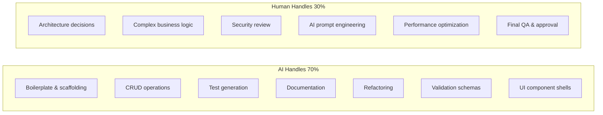
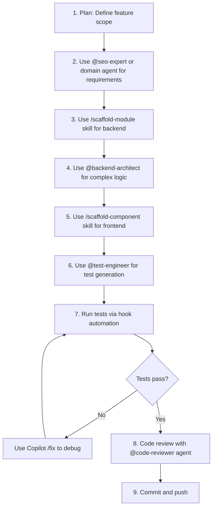
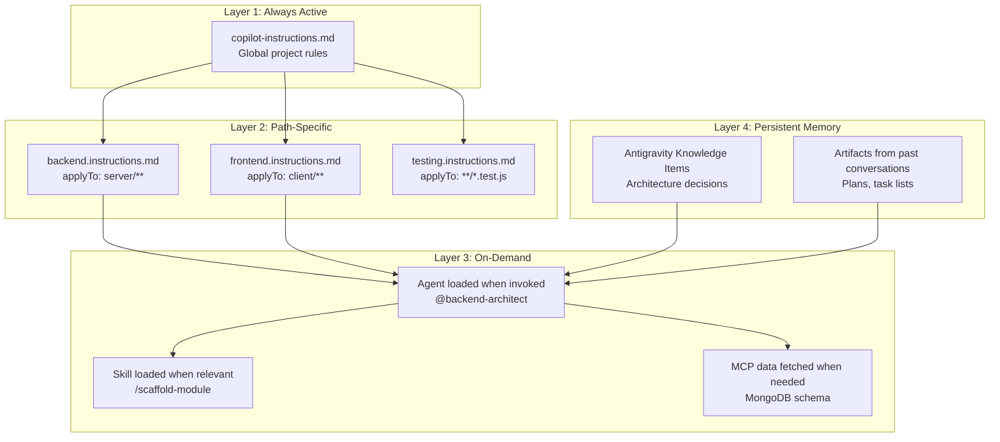
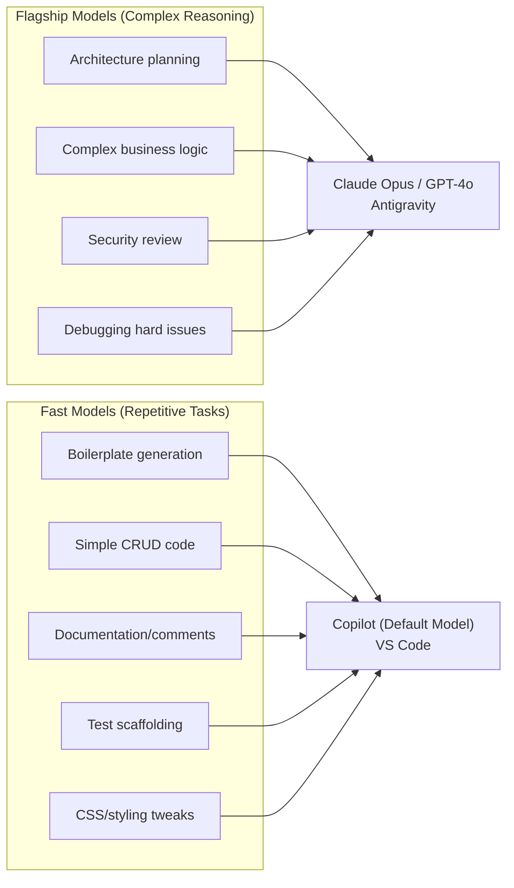
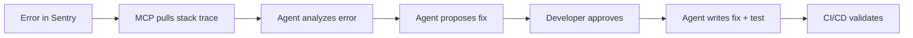
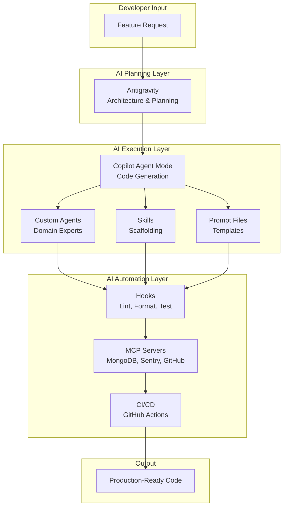

# AI-Powered Vibe Coding Workflow — Part 2

## Development Workflow, Context Optimization & Step-by-Step Implementation

> **Continued from:** [Part 1 — Copilot Architecture & Customization](./04-ai-vibe-coding-workflow.md)

---

## Table of Contents

9. [Development Workflow Strategy](#9-development-workflow-strategy)
10. [Context & Memory Optimization](#10-context--memory-optimization)
11. [Token Reduction Strategies](#11-token-reduction-strategies)
12. [Model Orchestration Strategy](#12-model-orchestration-strategy)
13. [Step-by-Step Implementation Guide](#13-step-by-step-implementation-guide)
14. [Automation Pipelines](#14-automation-pipelines)
15. [Quality Assurance with AI](#15-quality-assurance-with-ai)
16. [Production Readiness Checklist](#16-production-readiness-checklist)

---

## 9. Development Workflow Strategy

### 9.1 The 70/30 Rule for AI-Assisted Development



### 9.2 Feature Development Workflow

For each of the 42 features, follow this **Plan → Build → Verify** cycle:



### 9.3 Session Management Strategy

| Rule | Why |
|------|-----|
| **One feature per chat session** | Prevents context drift and confusion |
| **Start fresh for each module** | Clean context = better output quality |
| **Use `/compact` when context grows** | Summarizes history, frees token space |
| **Save successful patterns as Skills** | Never repeat a working workflow manually |
| **Use Artifacts for complex planning** | Antigravity artifacts persist across sessions |

### 9.4 Daily Vibe Coding Workflow

```
Morning Session (Architecture & Backend):
├── Open Antigravity → Plan today's feature with artifact
├── Switch to VS Code → Use Copilot agents for backend
├── @backend-architect → Design API module
├── /scaffold-module → Generate boilerplate
├── Edit business logic manually (the 30%)
├── @test-engineer → Generate tests
└── Run tests → Fix with /fix if needed

Afternoon Session (Frontend & Integration):
├── @frontend-dev → Build React components
├── /scaffold-component → Generate UI shells
├── Wire up TanStack Query hooks
├── Antigravity browser subagent → Visual verification
├── @code-reviewer → Review full feature
└── Commit with descriptive message
```

---

## 10. Context & Memory Optimization

### 10.1 Context Architecture



### 10.2 Context Optimization Rules

| Strategy | Implementation | Token Savings |
|----------|---------------|---------------|
| **Layered instructions** | Split into global + path-specific files | ~40% less always-on context |
| **On-demand skills** | Skills load only when matched | ~60% less per session |
| **Scoped file references** | Use `#file` to include only relevant files | ~70% vs whole codebase |
| **MCP for live data** | Query MongoDB schema on-demand vs pasting | ~50% less manual context |
| **Fresh sessions per feature** | New chat for each module/feature | ~80% less stale context |
| **Compact command** | Use `/compact` to summarize long sessions | ~60% context recovery |

### 10.3 Antigravity Knowledge Items for Persistent Memory

Use Antigravity's KI system to store architecture decisions that persist across conversations:

| Knowledge Item | Contents |
|---------------|----------|
| `project-architecture` | Tech stack, folder structure, module pattern |
| `database-schemas` | All Mongoose schemas with indexes and relationships |
| `api-conventions` | Response format, error handling, auth middleware chain |
| `seo-scoring-methodology` | Weighted scoring algorithm, check definitions |
| `deployment-config` | Docker setup, env vars, hosting details |
| `ai-prompt-patterns` | Working Gemini prompt templates and patterns |

### 10.4 Context Feeding Pattern

When starting a new feature session, use this pattern to give the AI optimal context:

```
Step 1: Let copilot-instructions.md load automatically (Layer 1)
Step 2: Path-specific instructions activate based on file (Layer 2)
Step 3: Invoke the right agent: @backend-architect
Step 4: Reference specific files: #file:server/models/User.model.js
Step 5: State your intent clearly and specifically
```

**Example prompt:**
```
@backend-architect I need to create the backlink monitoring module.

Context:
- #file:server/models/Website.model.js (for websiteId reference)
- #file:server/modules/keywords/keywords.service.js (for pattern reference)

Requirements:
- Store backlinks from DataForSEO API responses
- Track new/lost/broken status
- Calculate toxicity scores
- Support pagination and filtering by status

Use /scaffold-module to generate the base, then customize the service layer.
```

---

## 11. Token Reduction Strategies

### 11.1 Prompt Engineering Efficiency

| Technique | Example | Token Savings |
|-----------|---------|---------------|
| **Be specific, not verbose** | "Create Express route for POST /api/v1/backlinks with Zod validation" vs. "I need an endpoint..." | ~30% |
| **Reference existing patterns** | "Follow the same pattern as keywords.service.js" | ~50% (no re-explaining) |
| **Use skills for repetitive tasks** | `/scaffold-module` instead of explaining the pattern each time | ~70% |
| **Structured output requests** | "Return JSON: { files: [{path, content}] }" | ~40% less verbose output |
| **Avoid re-explaining the stack** | Instructions file handles this automatically | ~90% per prompt |

### 11.2 Output Optimization

| Strategy | How |
|----------|-----|
| **Request file-by-file** | "Generate the model first, then I'll ask for the service" |
| **Suppress explanations** | "Generate only code, no explanations" when you know what you want |
| **Use diff format** | "Show only the changes needed, not the full file" for modifications |
| **Batch related requests** | "Generate all 5 SEO check functions in one response" |

### 11.3 Pre-Agentic Data Gathering

Before invoking an agent for a complex task, gather data with cheap commands:

```bash
# Gather project structure (cheap CLI call)
find server/modules -type f -name "*.js" | head -50 > .context/module-list.txt

# Gather existing schemas (cheap CLI call)  
grep -r "new mongoose.Schema" server/models/ > .context/schema-summary.txt

# Then tell the agent to read these files instead of exploring the codebase
```

---

## 12. Model Orchestration Strategy

### 12.1 Right Model for the Right Task



### 12.2 Tool Selection per Task

| Task | Tool | Model | Why |
|------|------|-------|-----|
| Plan a new module | Antigravity | Claude Opus | Large context, artifact output |
| Scaffold boilerplate | Copilot Skill | Default | Fast, pattern-based |
| Write complex service logic | Copilot Agent | Best available | Needs project context |
| Debug a tricky bug | Antigravity | Claude Opus | Deep reasoning needed |
| Generate 20 unit tests | Copilot `/tests` | Default | Fast, repetitive |
| Design database schema | Copilot + MongoDB MCP | Default | Live schema context |
| Review a pull request | Copilot Agent | Best available | Code analysis |
| Write API documentation | Copilot `/doc` | Default | Fast, pattern-based |
| Build complex UI page | Antigravity | Claude Opus | Browser verification |
| Write Docker/CI config | Copilot @devops | Default | Template-based |

---

## 13. Step-by-Step Implementation Guide

### Phase 1: Project Setup (Day 1-2)

```
Step 1: Initialize project
├── Create project directory structure
├── Run: npx -y create-vite@latest client -- --template react
├── Run: npm init -y in server/
├── Install all dependencies
└── AI Role: Copilot agent mode for file creation

Step 2: Set up AI infrastructure
├── Create .github/copilot-instructions.md (copy from report)
├── Create all .instructions.md files
├── Create all .agent.md files
├── Create all skill folders with SKILL.md
├── Create all .prompt.md files
├── Configure MCP servers in .vscode/mcp.json
└── AI Role: Copilot generates from templates

Step 3: Configure development environment
├── Docker Compose for MongoDB + Redis
├── ESLint + Prettier configuration
├── Husky + lint-staged for git hooks
├── Environment variables (.env.example)
└── AI Role: @devops agent
```

### Phase 2: Authentication (Day 3-5)

```
Step 1: @backend-architect → Design auth module
Step 2: /scaffold-module → Generate auth boilerplate
Step 3: Manually implement JWT + refresh token rotation logic
Step 4: @test-engineer → Generate auth integration tests
Step 5: @frontend-dev → Build Login/Register pages
Step 6: Wire up Axios interceptor for token refresh
Step 7: Test full auth flow end-to-end
```

### Phase 3: SEO Analysis Engine (Day 6-12)

```
Step 1: @seo-expert → Define all audit checks and scoring
Step 2: /seo-audit-check prompt → Generate each check function
Step 3: @backend-architect → Build audit orchestrator service
Step 4: /add-bullmq-job → Create audit queue + processor
Step 5: /gemini-prompt → Create SEO report prompt template
Step 6: @frontend-dev → Build SEO Analyzer page
Step 7: @test-engineer → Test audit pipeline
```

### Phase 4: Rank Tracking (Day 13-20)

```
Step 1: @backend-architect → Design keyword + ranking modules
Step 2: /scaffold-module → Generate keyword CRUD
Step 3: Manually implement Browserbase + Stagehand integration
Step 4: /add-bullmq-job → Create rank-check queue
Step 5: @seo-expert → Define SERP parsing logic
Step 6: @frontend-dev → Build Rankings dashboard with Recharts
Step 7: Connect BullMQ scheduler for daily checks
```

### Phase 5-8: Continue pattern for remaining features...

Each feature follows: **Plan → Scaffold → Customize → Test → Review**

---

## 14. Automation Pipelines

### 14.1 Feature Development Pipeline

```mermaid
flowchart LR
    A["Developer describes feature"] --> B["AI generates plan"]
    B --> C["Skill scaffolds boilerplate"]
    C --> D["Developer writes business logic"]
    D --> E["AI generates tests"]
    E --> F["Hook runs linter"]
    F --> G["Hook runs tests"]
    G --> H["AI generates docs"]
    H --> I["AI reviews code"]
    I --> J["Commit + Push"]
    J --> K["CI/CD runs"]
```



### 14.2 Bug Fix Pipeline



### 14.3 New SEO Check Pipeline

```
1. @seo-expert → Define what to check and how to score
2. /seo-audit-check → Generate check function from template
3. @backend-architect → Integrate into audit orchestrator
4. @test-engineer → Generate unit test for the check
5. @frontend-dev → Add check result display to audit UI
```

---

## 15. Quality Assurance with AI

### 15.1 Code Review Agent Workflow

The `@code-reviewer` agent should check:

```markdown
## Review Checklist
1. Does the code follow the module pattern (controller → service → model)?
2. Is input validation implemented with Zod?
3. Are all async controllers wrapped in asyncHandler?
4. Does the response format match { success, data, error }?
5. Are there proper error codes (400, 401, 403, 404, 500)?
6. Is .lean() used for read-only queries?
7. Are sensitive fields excluded with .select()?
8. Are there any security issues (SQL/NoSQL injection, XSS)?
9. Does the code have appropriate logging?
10. Are edge cases handled?
```

### 15.2 Testing Strategy with AI

| Test Type | Tool | AI Workflow |
|-----------|------|-------------|
| **Unit Tests** | Vitest | @test-engineer generates from service functions |
| **API Tests** | Supertest | @test-engineer generates from route definitions |
| **E2E Tests** | Playwright | Antigravity browser subagent verifies flows |
| **Load Tests** | k6 | @devops generates load test scripts |

### 15.3 Continuous Quality Hooks

```
Pre-Commit: ESLint + Prettier (via Husky)
Post-Edit: Auto-format changed files (Copilot hook)
Post-Test: Coverage check (Copilot hook)
Pre-PR: Run full test suite (GitHub Actions)
Post-Merge: Deploy to staging (GitHub Actions)
```

---

## 16. Production Readiness Checklist

### 16.1 AI-Assisted Production Prep

| Task | AI Tool | Agent/Skill |
|------|---------|-------------|
| Security audit | Copilot | @code-reviewer with security focus |
| Performance review | Antigravity | Analyze all DB queries for missing indexes |
| Docker optimization | Copilot | @devops for multi-stage build |
| API documentation | Copilot | `/doc` on all route files |
| Error handling review | Copilot | @backend-architect |
| Test coverage gaps | Copilot | @test-engineer |
| Environment config | Copilot | @devops for .env validation |
| Monitoring setup | Copilot | @devops for Sentry + health checks |

### 16.2 Speed Multiplier Summary

| Without AI | With AI Vibe Coding | Speed Gain |
|------------|---------------------|------------|
| Manually write each model, route, controller, service, validation | `/scaffold-module` generates all 5 files | **10x** |
| Write each test manually | @test-engineer generates comprehensive tests | **8x** |
| Debug by reading logs | Sentry MCP + AI analysis | **5x** |
| Design schemas from scratch | MongoDB MCP + @db-architect | **6x** |
| Write Docker/CI configs | @devops generates from patterns | **10x** |
| Manual code review | @code-reviewer with checklist | **4x** |
| Write docs manually | `/doc` + Swagger auto-gen | **10x** |
| **Overall Project Timeline** | **26 weeks → ~6-8 weeks** | **~3-4x** |

### 16.3 Key Principles for Long-Term Maintainability

1. **Keep instructions up to date** — Update copilot-instructions.md when patterns evolve
2. **Save working patterns as skills** — If you wrote a great prompt, save it as a `.prompt.md`
3. **Use agents for consistency** — Same agent = same coding style across the project
4. **Review AI output always** — AI is a draft writer, you are the editor
5. **Track token usage** — Monitor costs, optimize expensive workflows
6. **Version your AI configs** — `.github/` directory is committed to git, evolves with the project
7. **Fresh sessions** — Start new chats per feature to prevent context pollution

---

## Summary: Complete AI Tooling Ecosystem



---

> **End of AI Vibe Coding Workflow Report**  
> **Files:** 5 custom agents, 8 reusable skills, 6 prompt templates, 3 automation hooks, 3 MCP integrations  
> **Estimated Speed Gain:** 3-4x overall (26 weeks → 6-8 weeks)  
> **Token Optimization:** ~50-70% reduction through layered context and skills
