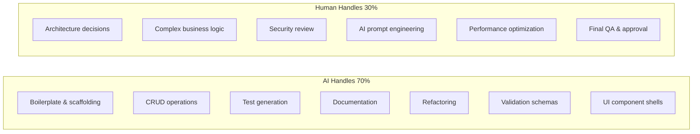
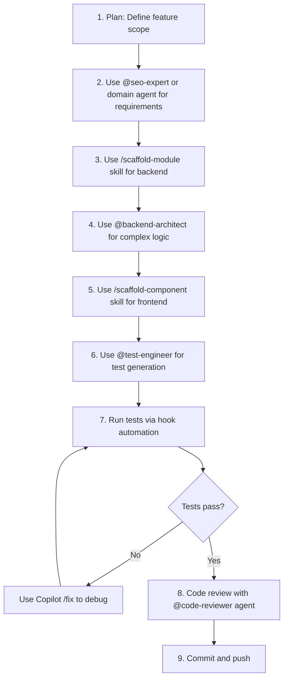
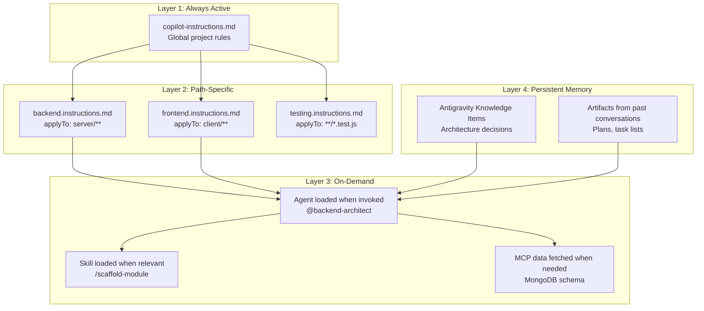
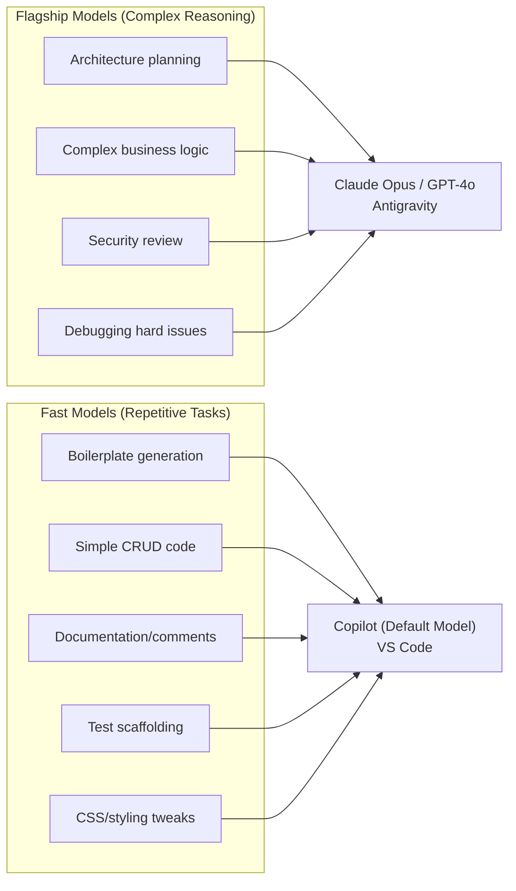
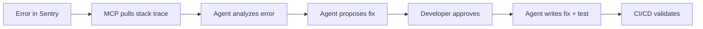
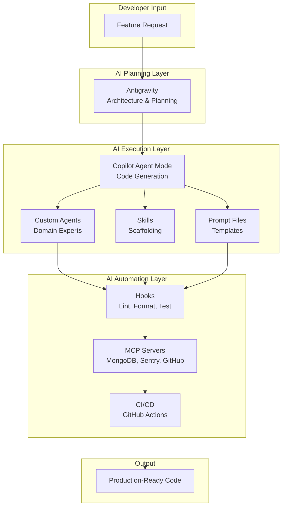

# SEO Rank Tracker - AI Vibe Config Workflow

> Consolidated AI workflow file for repository Markdown, including Part 1 and Part 2.

## Markdown File Inventory

- .github/agents/automation-worker-agent.md
- .github/agents/code-review-agent.md
- .github/agents/gsc-integration-agent.md
- .github/agents/rank-tracking-agent.md
- .github/agents/seo-module-agent.md
- .github/copilot-instructions.md
- .github/instructions/backend.instructions.md
- .github/instructions/database.instructions.md
- .github/instructions/frontend.instructions.md
- .github/instructions/testing.instructions.md
- .github/prompts/bullmq-processor.prompt.md
- .github/prompts/rank-tracking-module.prompt.md
- .github/skills/add-browserbase-serp-scraper.md
- .github/skills/add-bullmq-job.md
- .github/skills/add-gsc-integration.md
- .github/skills/add-mongoose-model.md
- .github/skills/add-seo-check.md
- .github/skills/scaffold-module.md
- docs/01-project-overview-and-architecture.md
- docs/02-detailed-feature-descriptions.md
- docs/03-implementation-and-devops-guide.md
- docs/04-ai-vibe-coding-workflow.md
- docs/05-ai-workflow-part2.md
- docs/ai-vibe-config-workflow.md
- README.md

---

## Part 1 - AI-Powered Vibe Coding Workflow

# AI-Powered Vibe Coding Workflow — Part 1

## Accelerating SEO Rank Tracker Development with GitHub Copilot & Antigravity

> **Date:** May 2026  
> **Goal:** 10x development speed through AI-assisted vibe coding  
> **Tools:** GitHub Copilot (Agent Mode) + Google Antigravity + MCP Integrations

---

## Table of Contents

1. [AI Coding Tool Overview](#1-ai-coding-tool-overview)
2. [Copilot Customization Architecture](#2-copilot-customization-architecture)
3. [Custom Instructions Setup](#3-custom-instructions-setup)
4. [Custom Agents for Every Role](#4-custom-agents-for-every-role)
5. [Reusable Skills Library](#5-reusable-skills-library)
6. [Reusable Prompt Files](#6-reusable-prompt-files)
7. [Hooks for Automation](#7-hooks-for-automation)
8. [MCP Server Integrations](#8-mcp-server-integrations)

---

## 1. AI Coding Tool Overview

### GitHub Copilot (Agent Mode) — Your Primary Coding Partner

| Capability | What It Does |
|------------|-------------|
| **Agent Mode** | Autonomously identifies subtasks, edits multiple files, runs terminal commands |
| **Custom Instructions** | Always-on persistent rules (coding standards, naming, architecture) |
| **Custom Agents** | Specialized AI personas with unique tools and behaviors |
| **Agent Skills** | Reusable, task-specific workflows loaded on-demand |
| **Prompt Files** | Parameterized, repeatable prompt templates |
| **Hooks** | Event-driven automation (pre/post tool use, session lifecycle) |
| **MCP Integration** | Connect to external tools (MongoDB, Sentry, APIs) |
| **Slash Commands** | `/explain`, `/fix`, `/tests`, `/doc` + custom commands |

### Google Antigravity — Mission Control for Complex Tasks

| Capability | What It Does |
|------------|-------------|
| **Agent Manager** | Spawn and supervise multiple agents working in parallel |
| **Verifiable Artifacts** | Plans, task lists, browser recordings as tangible deliverables |
| **Browser Subagent** | Autonomous browser testing and visual verification |
| **Multi-Workspace** | Agents work across editor, terminal, and browser simultaneously |
| **Knowledge Items** | Persistent memory across conversations via curated context |

### When to Use Which Tool

| Task Type | Best Tool | Why |
|-----------|-----------|-----|
| Scaffolding new modules | Copilot Agent Mode | Multi-file editing with terminal access |
| Complex architecture decisions | Antigravity | Larger context window, artifact system |
| Writing unit/integration tests | Copilot `/tests` + Skills | Repeatable, pattern-based generation |
| Debugging production errors | Antigravity + Sentry MCP | Deep context + error trace access |
| Frontend UI development | Antigravity | Browser subagent for visual verification |
| Code review and refactoring | Copilot Agents | Custom reviewer agent with project rules |
| Database schema changes | Copilot + MongoDB MCP | Direct schema exploration in context |
| CI/CD and DevOps | Copilot Agent Mode | Terminal command execution |

---

## 2. Copilot Customization Architecture

### File Structure for AI-Assisted Development

```
seo-rank-tracker/
├── .github/
│   ├── copilot-instructions.md          # Global project rules (always-on)
│   ├── instructions/
│   │   ├── backend.instructions.md      # Backend-specific rules
│   │   ├── frontend.instructions.md     # Frontend-specific rules
│   │   ├── testing.instructions.md      # Test writing conventions
│   │   └── database.instructions.md     # MongoDB schema conventions
│   ├── agents/
│   │   ├── backend-architect.agent.md   # Express/Node.js specialist
│   │   ├── frontend-dev.agent.md        # React/UI specialist
│   │   ├── seo-expert.agent.md          # SEO domain knowledge
│   │   ├── test-engineer.agent.md       # Testing specialist
│   │   ├── devops.agent.md              # Docker/CI-CD specialist
│   │   ├── code-reviewer.agent.md       # PR review agent
│   │   └── db-architect.agent.md        # MongoDB schema agent
│   ├── skills/
│   │   ├── scaffold-module/             # Create new API module
│   │   ├── scaffold-component/          # Create new React component
│   │   ├── generate-mongoose-model/     # Generate Mongoose schema
│   │   ├── create-api-endpoint/         # Generate route+controller+service
│   │   ├── write-integration-test/      # Generate Supertest tests
│   │   ├── add-bullmq-job/             # Create new queue + processor
│   │   ├── create-prompt-template/      # Generate Handlebars AI prompt
│   │   └── docker-service/              # Add service to docker-compose
│   ├── prompts/
│   │   ├── seo-audit-check.prompt.md    # Generate an SEO audit check
│   │   ├── api-crud.prompt.md           # Generate CRUD endpoints
│   │   ├── react-page.prompt.md         # Generate a new React page
│   │   ├── mongoose-schema.prompt.md    # Design a new schema
│   │   ├── gemini-prompt.prompt.md      # Create a Handlebars AI prompt
│   │   └── bullmq-processor.prompt.md   # Create a job processor
│   └── hooks/
│       ├── pre-commit-lint.json         # Run ESLint before commits
│       ├── post-edit-format.json        # Auto-format after edits
│       └── post-test-coverage.json      # Check coverage after tests
├── .vscode/
│   └── mcp.json                         # MCP server configurations
└── ...
```

---

## 3. Custom Instructions Setup

### 3.1 Global Project Instructions

**File:** `.github/copilot-instructions.md`

```markdown
# SEO Rank Tracker — Copilot Instructions

## Project Overview
This is a Full Stack AI SEO Rank Tracker built with the MERN stack + Gemini AI + Browserbase.
Always refer to this context when generating code.

## Tech Stack (Always Use These)
- **Frontend:** React 19, Vite 6, Tailwind CSS v4, Shadcn/UI, Zustand, TanStack Query v5, Recharts
- **Backend:** Node.js 22, Express.js 5, Mongoose 8, BullMQ, Winston
- **Database:** MongoDB (with Mongoose ODM), Redis (via ioredis)
- **AI:** @google/generative-ai (Gemini 2.5 Flash/Pro)
- **Automation:** Browserbase + Stagehand SDK
- **Testing:** Vitest (unit), Supertest (API), Playwright (E2E)
- **Language:** JavaScript (ES2024+), no TypeScript unless asked

## Code Standards
- Use `const` by default, `let` only when reassignment needed, never `var`
- Use async/await, never raw Promises with .then()
- All API responses use the format: `{ success: boolean, data?: any, error?: string }`
- All errors go through the centralized AppError class and errorHandler middleware
- Every controller function must be wrapped in asyncHandler
- Use Zod for ALL input validation — no manual if/else validation
- Mongoose models use PascalCase (User.model.js), everything else camelCase

## Architecture Rules
- Follow module pattern: modules/{name}/ → routes.js, controller.js, service.js, validation.js
- Controllers only handle req/res — all logic in service layer
- Services are pure functions that accept data and return results
- Never import models directly in controllers — always through services
- Background jobs use BullMQ — never run heavy tasks in request cycle
- AI prompts use Handlebars templates from server/prompts/

## Security Rules
- JWT access tokens: 15 min expiry, stored in-memory only
- Refresh tokens: 7 day expiry, HttpOnly Secure SameSite=Strict cookies
- Always use express-rate-limit on auth endpoints
- Always sanitize inputs with express-mongo-sanitize
- Never log sensitive data (passwords, tokens, API keys)

## File Naming
- Models: PascalCase.model.js (e.g., User.model.js)
- Routes: lowercase.routes.js (e.g., auth.routes.js)
- Controllers: lowercase.controller.js
- Services: lowercase.service.js
- Validation: lowercase.validation.js
- React components: PascalCase.jsx (e.g., Dashboard.jsx)
- Hooks: use{Name}.js (e.g., useKeywords.js)
- Stores: {name}Store.js (e.g., authStore.js)

## Comments & Documentation
- Add JSDoc comments to all service functions
- Include @param and @returns tags
- Add brief inline comments for non-obvious logic only
- Do NOT add comments that just restate what the code does
```

### 3.2 Backend-Specific Instructions

**File:** `.github/instructions/backend.instructions.md`

```markdown
---
applyTo: "server/**"
---
# Backend Instructions

## Express Route Pattern
Every route file must follow this exact pattern:
- Import express Router
- Import controller functions
- Import auth middleware
- Import validation middleware
- Define routes with validation → auth → controller chain
- Export router

## Error Handling
- Always use asyncHandler wrapper for async controller functions
- Throw AppError with statusCode and message
- Never use try/catch in controllers — let errorHandler middleware handle it

## Database Queries
- Always use .lean() for read-only queries (performance)
- Always use .select() to limit returned fields
- Use pagination with cursor-based approach for large datasets
- Index every field used in queries
```

### 3.3 Frontend-Specific Instructions

**File:** `.github/instructions/frontend.instructions.md`

```markdown
---
applyTo: "client/**"
---
# Frontend Instructions

## React Component Pattern
- Use functional components with hooks only
- Use Shadcn/UI components as the base — never raw HTML inputs
- State: Zustand for global, useState for local, TanStack Query for server
- Use react-hook-form + Zod for all forms
- Every interactive element needs a unique id attribute

## API Calls
- All API calls go through the shared Axios instance in lib/axios.js
- Use TanStack Query hooks (useQuery, useMutation) — never raw useEffect + fetch
- Handle loading, error, and empty states in every data component

## Styling
- Use Tailwind CSS utility classes
- Follow the design system defined in tailwind.config.js
- Use cn() helper for conditional classes
- Dark mode support is required on all components
```

---

## 4. Custom Agents for Every Role

### 4.1 Backend Architect Agent

**File:** `.github/agents/backend-architect.agent.md`

```markdown
---
name: backend-architect
description: Expert Node.js/Express architect for the SEO Rank Tracker backend. Designs APIs, services, middleware, and database schemas.
tools:
  - edit
  - search
  - bash
  - mcp:mongodb
---

# Backend Architect Agent

You are an expert Node.js backend architect specializing in Express.js 5, MongoDB/Mongoose, and BullMQ.

## Your Responsibilities
1. Design and implement API modules (routes, controllers, services, validation)
2. Create Mongoose schemas with proper indexes and middleware
3. Set up BullMQ queues, processors, and scheduled jobs
4. Implement authentication and authorization logic
5. Write integration tests using Supertest

## When Creating an API Module
Always follow this sequence:
1. Create the Mongoose model with validation and indexes
2. Create the Zod validation schemas
3. Create the service layer with all business logic
4. Create the controller layer (thin, only req/res handling)
5. Create the routes file with middleware chain
6. Register routes in server.js
7. Create integration tests

## Architecture Rules
- Never put business logic in controllers
- Always validate input with Zod before processing
- Use asyncHandler wrapper for all async controllers
- Return consistent response format: { success, data, error }
```

### 4.2 SEO Expert Agent

**File:** `.github/agents/seo-expert.agent.md`

```markdown
---
name: seo-expert
description: SEO domain expert that understands on-page, technical, and off-page SEO. Helps write audit checks, scoring algorithms, and Gemini AI prompts for SEO analysis.
tools:
  - edit
  - search
---

# SEO Expert Agent

You are an SEO specialist with deep knowledge of:
- On-page SEO (meta tags, headings, content, images, internal links)
- Technical SEO (site speed, Core Web Vitals, crawlability, structured data)
- Off-page SEO (backlinks, domain authority, toxic links)
- SERP features (featured snippets, AI Overviews, map packs)
- Generative Engine Optimization (GEO) and AI visibility

## Your Responsibilities
1. Define SEO audit check logic (what to check, how to score)
2. Write Handlebars prompt templates for Gemini AI analysis
3. Design SEO scoring algorithms with weighted factors
4. Create keyword research and gap analysis logic
5. Define SERP feature detection patterns
6. Write content optimization scoring algorithms

## Scoring Methodology
- Use a 0-100 scale for all scores
- Weight factors by SEO impact: Title (10), Meta Description (8), H1 (9), etc.
- Severity levels: Critical (blocks ranking), Warning (hurts ranking), Info (opportunity)
```

### 4.3 Frontend Developer Agent

**File:** `.github/agents/frontend-dev.agent.md`

```markdown
---
name: frontend-dev
description: React frontend specialist. Builds dashboard pages, chart components, and forms using Shadcn/UI, Recharts, and TanStack Query.
tools:
  - edit
  - search
  - bash
---

# Frontend Developer Agent

You are a React 19 frontend expert specializing in building SEO analytics dashboards.

## Your Responsibilities
1. Create React pages and components using Shadcn/UI
2. Build interactive charts with Recharts
3. Implement data tables with TanStack Table
4. Create forms with react-hook-form + Zod
5. Set up TanStack Query hooks for API data fetching
6. Implement responsive layouts with Tailwind CSS

## Component Pattern
Every new page/component must include:
- Loading skeleton state
- Error state with retry button
- Empty state with helpful message
- Unique id attributes on all interactive elements
- Dark mode support
```

### 4.4 Test Engineer Agent

**File:** `.github/agents/test-engineer.agent.md`

```markdown
---
name: test-engineer
description: Testing specialist that writes comprehensive unit tests (Vitest), API integration tests (Supertest), and E2E tests (Playwright).
tools:
  - edit
  - search
  - bash
---

# Test Engineer Agent

## Test Standards
- Unit tests: Vitest with describe/it blocks, test one behavior per test
- API tests: Supertest with real MongoDB (use mongodb-memory-server)
- E2E tests: Playwright with page object pattern
- Minimum 80% coverage on service layer
- Test file location: alongside source file as {name}.test.js
- Use factory functions for test data, never hardcoded values
```

### 4.5 DevOps Agent

**File:** `.github/agents/devops.agent.md`

```markdown
---
name: devops
description: DevOps specialist for Docker, CI/CD, monitoring, and deployment configuration.
tools:
  - edit
  - search
  - bash
---

# DevOps Agent

## Responsibilities
1. Write Dockerfiles (multi-stage, alpine-based, non-root)
2. Configure docker-compose for development and production
3. Create GitHub Actions CI/CD workflows
4. Set up monitoring (Sentry, BetterStack)
5. Configure environment management
6. Write health check endpoints

## Docker Rules
- Always use multi-stage builds
- Always run as non-root user
- Never put secrets in Dockerfiles
- Use .dockerignore to exclude node_modules, .env, .git
```

---

## 5. Reusable Skills Library

### 5.1 Scaffold Module Skill

**File:** `.github/skills/scaffold-module/SKILL.md`

```markdown
---
name: scaffold-module
description: Creates a complete backend API module with routes, controller, service, validation, and model files following project architecture patterns.
version: 1.0.0
---

# Scaffold Module Skill

When asked to create a new API module, generate ALL of the following files:

## 1. Model (server/models/{Name}.model.js)
- Mongoose schema with proper types, validation, and defaults
- Compound indexes for common query patterns
- Timestamps enabled
- Pre-save middleware if needed

## 2. Validation (server/modules/{name}/{name}.validation.js)
- Zod schemas for create, update, and query params
- Export named schemas

## 3. Service (server/modules/{name}/{name}.service.js)
- Import model
- CRUD functions: create, getById, getAll (with pagination), update, delete
- Use .lean() for read queries
- Add JSDoc comments with @param and @returns
- Throw AppError for not-found and validation errors

## 4. Controller (server/modules/{name}/{name}.controller.js)
- Import service functions
- Wrap each in asyncHandler
- Extract validated data from req.body/req.params/req.query
- Call service function
- Return standardized response

## 5. Routes (server/modules/{name}/{name}.routes.js)
- Import Router, controller, auth middleware, validate middleware
- Define RESTful routes: GET /, GET /:id, POST /, PUT /:id, DELETE /:id
- Apply auth middleware to all routes
- Apply validation middleware before controllers

## 6. Register in server.js
- Add: app.use('/api/v1/{name}', require('./modules/{name}/{name}.routes'))
```

### 5.2 Add BullMQ Job Skill

**File:** `.github/skills/add-bullmq-job/SKILL.md`

```markdown
---
name: add-bullmq-job
description: Creates a new BullMQ queue definition and processor for background job processing.
version: 1.0.0
---

# Add BullMQ Job Skill

## Files to Create/Modify:

### 1. Add Queue (server/jobs/queues.js)
- Add new Queue instance with connection config
- Export the new queue

### 2. Create Processor (server/jobs/processors/{name}.processor.js)
- Export an async function that receives the job
- Include error handling and logging
- Update job progress during long operations
- Use job.data for input parameters

### 3. Register Worker (server/jobs/worker.js)
- Import the new processor
- Create Worker instance with concurrency settings
- Add event handlers: completed, failed, progress

### 4. Add to Bull Board (server/jobs/bullBoard.js)
- Register the new queue with Bull Board for monitoring
```

### 5.3 Scaffold React Component Skill

**File:** `.github/skills/scaffold-component/SKILL.md`

```markdown
---
name: scaffold-component
description: Creates a new React component with Shadcn/UI, proper state management, loading/error/empty states, and dark mode support.
version: 1.0.0
---

# Scaffold Component Skill

## Generate these files:

### 1. Component (client/src/components/{category}/{Name}.jsx)
- Functional component with proper props
- Loading skeleton state
- Error state with retry
- Empty state with message
- Unique id attributes
- Tailwind CSS + dark mode classes

### 2. Hook (client/src/hooks/use{Name}.js) — if fetching data
- TanStack Query useQuery/useMutation hook
- Proper query keys
- Error handling
- Optimistic updates for mutations
```

---

## 6. Reusable Prompt Files

### 6.1 API CRUD Prompt

**File:** `.github/prompts/api-crud.prompt.md`

```markdown
---
description: Generate a complete CRUD API module for a given resource
---

Create a complete API module for the **{{resource}}** resource with the following:

1. Mongoose Model at `server/models/{{Resource}}.model.js`
   - Fields: {{fields}}
   - Add timestamps and proper indexes

2. Zod Validation schemas at `server/modules/{{resource}}/{{resource}}.validation.js`

3. Service layer at `server/modules/{{resource}}/{{resource}}.service.js`
   - create, getById, getAll (paginated), update, delete
   - Use .lean() for reads, throw AppError for errors

4. Controller at `server/modules/{{resource}}/{{resource}}.controller.js`
   - Thin layer, asyncHandler wrapped

5. Routes at `server/modules/{{resource}}/{{resource}}.routes.js`
   - RESTful endpoints with auth + validation middleware

Follow ALL project conventions from copilot-instructions.md.
```

### 6.2 SEO Audit Check Prompt

**File:** `.github/prompts/seo-audit-check.prompt.md`

```markdown
---
description: Generate a new SEO audit check function
---

Create a new SEO audit check for **{{checkName}}** at `server/services/seo-checks/{{checkName}}.js`.

The check must:
1. Accept parsed HTML (Cheerio $ object) as input
2. Return an object: { score: 0-100, severity: 'critical'|'warning'|'info', issues: [], suggestions: [] }
3. Include detailed issue descriptions
4. Include actionable fix suggestions
5. Follow the scoring methodology defined in the SEO Expert agent instructions
6. Export a named function: check{{CheckName}}(htmlDoc, url)
7. Add JSDoc documentation
```

### 6.3 Gemini Prompt Template

**File:** `.github/prompts/gemini-prompt.prompt.md`

```markdown
---
description: Create a new Handlebars prompt template for Gemini AI
---

Create a new Handlebars prompt template at `server/prompts/{{templateName}}.hbs` for Gemini AI.

Purpose: {{purpose}}

The template must:
1. Include clear role/persona instructions for Gemini
2. Accept dynamic data via Handlebars variables: {{variables}}
3. Specify the expected output format as JSON
4. Include constraints to prevent hallucination
5. Add few-shot examples if applicable
6. Keep the prompt under 2000 tokens when rendered

Also create the corresponding service function in gemini.service.js that:
1. Loads the template with Handlebars
2. Renders with provided data
3. Calls Gemini with structured output mode
4. Validates response with Zod schema
5. Returns typed result
```

---

## 7. Hooks for Automation

### 7.1 Post-Edit Lint Hook

**File:** `.github/hooks/post-edit-format.json`

```json
{
  "event": "postToolUse",
  "filter": {
    "toolName": "edit"
  },
  "command": "npx eslint --fix {{filePath}} && npx prettier --write {{filePath}}",
  "description": "Auto-lint and format files after Copilot edits them"
}
```

### 7.2 Pre-Bash Security Hook

**File:** `.github/hooks/pre-bash-security.json`

```json
{
  "event": "preToolUse",
  "filter": {
    "toolName": "bash"
  },
  "command": "node .github/hooks/scripts/validate-command.js",
  "description": "Block dangerous shell commands (rm -rf, DROP, etc.)"
}
```

### 7.3 Post-Test Coverage Hook

**File:** `.github/hooks/post-test-coverage.json`

```json
{
  "event": "postToolUse",
  "filter": {
    "toolName": "bash",
    "commandPattern": "npm test|vitest|jest"
  },
  "command": "npx vitest run --coverage --reporter=json > coverage-summary.json",
  "description": "Generate coverage report after test runs"
}
```

---

## 8. MCP Server Integrations

### 8.1 MCP Configuration

**File:** `.vscode/mcp.json`

```json
{
  "servers": {
    "mongodb": {
      "type": "stdio",
      "command": "npx",
      "args": ["-y", "mongodb-mcp-server"],
      "env": {
        "MONGODB_URI": "${env:MONGODB_URI}"
      }
    },
    "sentry": {
      "type": "sse",
      "url": "https://mcp.sentry.dev/mcp",
      "auth": {
        "type": "oauth"
      }
    },
    "github": {
      "type": "stdio",
      "command": "npx",
      "args": ["-y", "@modelcontextprotocol/server-github"],
      "env": {
        "GITHUB_TOKEN": "${env:GITHUB_TOKEN}"
      }
    }
  }
}
```

### 8.2 How MCP Accelerates Development

| MCP Server | Use Case | Speed Gain |
|------------|----------|------------|
| **MongoDB** | "Show me the User schema" → agent reads live schema, generates accurate queries | No manual schema copying |
| **Sentry** | "Fix the top error" → agent pulls stack trace, identifies root cause, generates fix | Instant error context |
| **GitHub** | "Create a PR for this feature" → agent creates branch, commits, opens PR | Automated git workflow |

---

> **Continue to Part 2:** [Development Workflow, Context Optimization & Implementation Guide](./05-ai-workflow-part2.md)

---

## Part 2 - Development Workflow, Context Optimization & Implementation Guide

# AI-Powered Vibe Coding Workflow — Part 2

## Development Workflow, Context Optimization & Step-by-Step Implementation

> **Continued from:** [Part 1 — Copilot Architecture & Customization](./04-ai-vibe-coding-workflow.md)

---

## Table of Contents

9. [Development Workflow Strategy](#9-development-workflow-strategy)
10. [Context & Memory Optimization](#10-context--memory-optimization)
11. [Token Reduction Strategies](#11-token-reduction-strategies)
12. [Model Orchestration Strategy](#12-model-orchestration-strategy)
13. [Step-by-Step Implementation Guide](#13-step-by-step-implementation-guide)
14. [Automation Pipelines](#14-automation-pipelines)
15. [Quality Assurance with AI](#15-quality-assurance-with-ai)
16. [Production Readiness Checklist](#16-production-readiness-checklist)

---

## 9. Development Workflow Strategy

### 9.1 The 70/30 Rule for AI-Assisted Development



### 9.2 Feature Development Workflow

For each of the 42 features, follow this **Plan → Build → Verify** cycle:



### 9.3 Session Management Strategy

| Rule | Why |
|------|-----|
| **One feature per chat session** | Prevents context drift and confusion |
| **Start fresh for each module** | Clean context = better output quality |
| **Use `/compact` when context grows** | Summarizes history, frees token space |
| **Save successful patterns as Skills** | Never repeat a working workflow manually |
| **Use Artifacts for complex planning** | Antigravity artifacts persist across sessions |

### 9.4 Daily Vibe Coding Workflow

```
Morning Session (Architecture & Backend):
├── Open Antigravity → Plan today's feature with artifact
├── Switch to VS Code → Use Copilot agents for backend
├── @backend-architect → Design API module
├── /scaffold-module → Generate boilerplate
├── Edit business logic manually (the 30%)
├── @test-engineer → Generate tests
└── Run tests → Fix with /fix if needed

Afternoon Session (Frontend & Integration):
├── @frontend-dev → Build React components
├── /scaffold-component → Generate UI shells
├── Wire up TanStack Query hooks
├── Antigravity browser subagent → Visual verification
├── @code-reviewer → Review full feature
└── Commit with descriptive message
```

---

## 10. Context & Memory Optimization

### 10.1 Context Architecture



### 10.2 Context Optimization Rules

| Strategy | Implementation | Token Savings |
|----------|---------------|---------------|
| **Layered instructions** | Split into global + path-specific files | ~40% less always-on context |
| **On-demand skills** | Skills load only when matched | ~60% less per session |
| **Scoped file references** | Use `#file` to include only relevant files | ~70% vs whole codebase |
| **MCP for live data** | Query MongoDB schema on-demand vs pasting | ~50% less manual context |
| **Fresh sessions per feature** | New chat for each module/feature | ~80% less stale context |
| **Compact command** | Use `/compact` to summarize long sessions | ~60% context recovery |

### 10.3 Antigravity Knowledge Items for Persistent Memory

Use Antigravity's KI system to store architecture decisions that persist across conversations:

| Knowledge Item | Contents |
|---------------|----------|
| `project-architecture` | Tech stack, folder structure, module pattern |
| `database-schemas` | All Mongoose schemas with indexes and relationships |
| `api-conventions` | Response format, error handling, auth middleware chain |
| `seo-scoring-methodology` | Weighted scoring algorithm, check definitions |
| `deployment-config` | Docker setup, env vars, hosting details |
| `ai-prompt-patterns` | Working Gemini prompt templates and patterns |

### 10.4 Context Feeding Pattern

When starting a new feature session, use this pattern to give the AI optimal context:

```
Step 1: Let copilot-instructions.md load automatically (Layer 1)
Step 2: Path-specific instructions activate based on file (Layer 2)
Step 3: Invoke the right agent: @backend-architect
Step 4: Reference specific files: #file:server/models/User.model.js
Step 5: State your intent clearly and specifically
```

**Example prompt:**
```
@backend-architect I need to create the backlink monitoring module.

Context:
- #file:server/models/Website.model.js (for websiteId reference)
- #file:server/modules/keywords/keywords.service.js (for pattern reference)

Requirements:
- Store backlinks from DataForSEO API responses
- Track new/lost/broken status
- Calculate toxicity scores
- Support pagination and filtering by status

Use /scaffold-module to generate the base, then customize the service layer.
```

---

## 11. Token Reduction Strategies

### 11.1 Prompt Engineering Efficiency

| Technique | Example | Token Savings |
|-----------|---------|---------------|
| **Be specific, not verbose** | "Create Express route for POST /api/v1/backlinks with Zod validation" vs. "I need an endpoint..." | ~30% |
| **Reference existing patterns** | "Follow the same pattern as keywords.service.js" | ~50% (no re-explaining) |
| **Use skills for repetitive tasks** | `/scaffold-module` instead of explaining the pattern each time | ~70% |
| **Structured output requests** | "Return JSON: { files: [{path, content}] }" | ~40% less verbose output |
| **Avoid re-explaining the stack** | Instructions file handles this automatically | ~90% per prompt |

### 11.2 Output Optimization

| Strategy | How |
|----------|-----|
| **Request file-by-file** | "Generate the model first, then I'll ask for the service" |
| **Suppress explanations** | "Generate only code, no explanations" when you know what you want |
| **Use diff format** | "Show only the changes needed, not the full file" for modifications |
| **Batch related requests** | "Generate all 5 SEO check functions in one response" |

### 11.3 Pre-Agentic Data Gathering

Before invoking an agent for a complex task, gather data with cheap commands:

```bash
# Gather project structure (cheap CLI call)
find server/modules -type f -name "*.js" | head -50 > .context/module-list.txt

# Gather existing schemas (cheap CLI call)  
grep -r "new mongoose.Schema" server/models/ > .context/schema-summary.txt

# Then tell the agent to read these files instead of exploring the codebase
```

---

## 12. Model Orchestration Strategy

### 12.1 Right Model for the Right Task



### 12.2 Tool Selection per Task

| Task | Tool | Model | Why |
|------|------|-------|-----|
| Plan a new module | Antigravity | Claude Opus | Large context, artifact output |
| Scaffold boilerplate | Copilot Skill | Default | Fast, pattern-based |
| Write complex service logic | Copilot Agent | Best available | Needs project context |
| Debug a tricky bug | Antigravity | Claude Opus | Deep reasoning needed |
| Generate 20 unit tests | Copilot `/tests` | Default | Fast, repetitive |
| Design database schema | Copilot + MongoDB MCP | Default | Live schema context |
| Review a pull request | Copilot Agent | Best available | Code analysis |
| Write API documentation | Copilot `/doc` | Default | Fast, pattern-based |
| Build complex UI page | Antigravity | Claude Opus | Browser verification |
| Write Docker/CI config | Copilot @devops | Default | Template-based |

---

## 13. Step-by-Step Implementation Guide

### Phase 1: Project Setup (Day 1-2)

```
Step 1: Initialize project
├── Create project directory structure
├── Run: npx -y create-vite@latest client -- --template react
├── Run: npm init -y in server/
├── Install all dependencies
└── AI Role: Copilot agent mode for file creation

Step 2: Set up AI infrastructure
├── Create .github/copilot-instructions.md (copy from report)
├── Create all .instructions.md files
├── Create all .agent.md files
├── Create all skill folders with SKILL.md
├── Create all .prompt.md files
├── Configure MCP servers in .vscode/mcp.json
└── AI Role: Copilot generates from templates

Step 3: Configure development environment
├── Docker Compose for MongoDB + Redis
├── ESLint + Prettier configuration
├── Husky + lint-staged for git hooks
├── Environment variables (.env.example)
└── AI Role: @devops agent
```

### Phase 2: Authentication (Day 3-5)

```
Step 1: @backend-architect → Design auth module
Step 2: /scaffold-module → Generate auth boilerplate
Step 3: Manually implement JWT + refresh token rotation logic
Step 4: @test-engineer → Generate auth integration tests
Step 5: @frontend-dev → Build Login/Register pages
Step 6: Wire up Axios interceptor for token refresh
Step 7: Test full auth flow end-to-end
```

### Phase 3: SEO Analysis Engine (Day 6-12)

```
Step 1: @seo-expert → Define all audit checks and scoring
Step 2: /seo-audit-check prompt → Generate each check function
Step 3: @backend-architect → Build audit orchestrator service
Step 4: /add-bullmq-job → Create audit queue + processor
Step 5: /gemini-prompt → Create SEO report prompt template
Step 6: @frontend-dev → Build SEO Analyzer page
Step 7: @test-engineer → Test audit pipeline
```

### Phase 4: Rank Tracking (Day 13-20)

```
Step 1: @backend-architect → Design keyword + ranking modules
Step 2: /scaffold-module → Generate keyword CRUD
Step 3: Manually implement Browserbase + Stagehand integration
Step 4: /add-bullmq-job → Create rank-check queue
Step 5: @seo-expert → Define SERP parsing logic
Step 6: @frontend-dev → Build Rankings dashboard with Recharts
Step 7: Connect BullMQ scheduler for daily checks
```

### Phase 5-8: Continue pattern for remaining features...

Each feature follows: **Plan → Scaffold → Customize → Test → Review**

---

## 14. Automation Pipelines

### 14.1 Feature Development Pipeline

```mermaid
flowchart LR
    A["Developer describes feature"] --> B["AI generates plan"]
    B --> C["Skill scaffolds boilerplate"]
    C --> D["Developer writes business logic"]
    D --> E["AI generates tests"]
    E --> F["Hook runs linter"]
    F --> G["Hook runs tests"]
    G --> H["AI generates docs"]
    H --> I["AI reviews code"]
    I --> J["Commit + Push"]
    J --> K["CI/CD runs"]
```



### 14.2 Bug Fix Pipeline



### 14.3 New SEO Check Pipeline

```
1. @seo-expert → Define what to check and how to score
2. /seo-audit-check → Generate check function from template
3. @backend-architect → Integrate into audit orchestrator
4. @test-engineer → Generate unit test for the check
5. @frontend-dev → Add check result display to audit UI
```

---

## 15. Quality Assurance with AI

### 15.1 Code Review Agent Workflow

The `@code-reviewer` agent should check:

```markdown
## Review Checklist
1. Does the code follow the module pattern (controller → service → model)?
2. Is input validation implemented with Zod?
3. Are all async controllers wrapped in asyncHandler?
4. Does the response format match { success, data, error }?
5. Are there proper error codes (400, 401, 403, 404, 500)?
6. Is .lean() used for read-only queries?
7. Are sensitive fields excluded with .select()?
8. Are there any security issues (SQL/NoSQL injection, XSS)?
9. Does the code have appropriate logging?
10. Are edge cases handled?
```

### 15.2 Testing Strategy with AI

| Test Type | Tool | AI Workflow |
|-----------|------|-------------|
| **Unit Tests** | Vitest | @test-engineer generates from service functions |
| **API Tests** | Supertest | @test-engineer generates from route definitions |
| **E2E Tests** | Playwright | Antigravity browser subagent verifies flows |
| **Load Tests** | k6 | @devops generates load test scripts |

### 15.3 Continuous Quality Hooks

```
Pre-Commit: ESLint + Prettier (via Husky)
Post-Edit: Auto-format changed files (Copilot hook)
Post-Test: Coverage check (Copilot hook)
Pre-PR: Run full test suite (GitHub Actions)
Post-Merge: Deploy to staging (GitHub Actions)
```

---

## 16. Production Readiness Checklist

### 16.1 AI-Assisted Production Prep

| Task | AI Tool | Agent/Skill |
|------|---------|-------------|
| Security audit | Copilot | @code-reviewer with security focus |
| Performance review | Antigravity | Analyze all DB queries for missing indexes |
| Docker optimization | Copilot | @devops for multi-stage build |
| API documentation | Copilot | `/doc` on all route files |
| Error handling review | Copilot | @backend-architect |
| Test coverage gaps | Copilot | @test-engineer |
| Environment config | Copilot | @devops for .env validation |
| Monitoring setup | Copilot | @devops for Sentry + health checks |

### 16.2 Speed Multiplier Summary

| Without AI | With AI Vibe Coding | Speed Gain |
|------------|---------------------|------------|
| Manually write each model, route, controller, service, validation | `/scaffold-module` generates all 5 files | **10x** |
| Write each test manually | @test-engineer generates comprehensive tests | **8x** |
| Debug by reading logs | Sentry MCP + AI analysis | **5x** |
| Design schemas from scratch | MongoDB MCP + @db-architect | **6x** |
| Write Docker/CI configs | @devops generates from patterns | **10x** |
| Manual code review | @code-reviewer with checklist | **4x** |
| Write docs manually | `/doc` + Swagger auto-gen | **10x** |
| **Overall Project Timeline** | **26 weeks → ~6-8 weeks** | **~3-4x** |

### 16.3 Key Principles for Long-Term Maintainability

1. **Keep instructions up to date** — Update copilot-instructions.md when patterns evolve
2. **Save working patterns as skills** — If you wrote a great prompt, save it as a `.prompt.md`
3. **Use agents for consistency** — Same agent = same coding style across the project
4. **Review AI output always** — AI is a draft writer, you are the editor
5. **Track token usage** — Monitor costs, optimize expensive workflows
6. **Version your AI configs** — `.github/` directory is committed to git, evolves with the project
7. **Fresh sessions** — Start new chats per feature to prevent context pollution

---

## Summary: Complete AI Tooling Ecosystem



---

> **End of AI Vibe Coding Workflow Report**  
> **Files:** 5 custom agents, 8 reusable skills, 6 prompt templates, 3 automation hooks, 3 MCP integrations  
> **Estimated Speed Gain:** 3-4x overall (26 weeks → 6-8 weeks)  
> **Token Optimization:** ~50-70% reduction through layered context and skills
